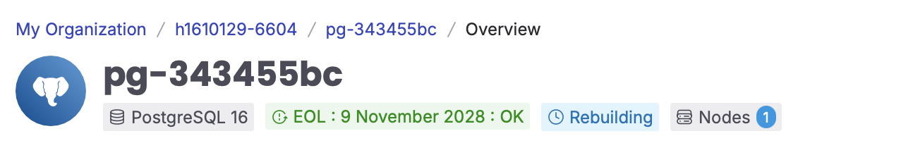
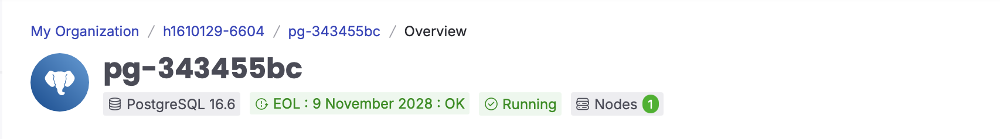

# CVWO Winter Assignment (SHRINIKET SUBRAMANIAN)

This repo contains the backend (Go) & frontend (Typescript) for my attempt of CVWO's Winter Assignment (to setup & run locally)

Link to deployed application: https://cvwo-assignment-4v24.onrender.com

# Local Installation

Clone the repo 
```console
   $ git clone https://github.com/shriniket03/CVWO-Assignment-local.git
```

## Dependencies

### Dependencies (Environment)

This application requires a .env file to be placed in the root of the repository. The env file needs to be given 2 parameters (DATABASE_URI & SECRET). 
You may find a template env file (.env.example) in the root of the repository. 

The SECRET variable is used for the signing of JWT Tokens (for user authentication). The parameter has already been assigned in the example file. 

The DATABASE_URI variable is used to connect with the PostgreSQL database that has been hosted on the cloud. The value has been omitted to prevent misuse.
Please refer to the Google Form submission for the secret key to be assigned to this DATABASE_URI Environment Variable 

#### Dependencies (Using a PostgreSQL DB hosted on the cloud)

To setup a local build, you will have to create your own PostgreSQL DB and set the value of DATABASE_URI as the secret key. 

The cloud service used to host the DB (for deployment) was Aiven Cloud. For the purpose of setting up a local environment, you can create a DB on the platform
as well. No credit card/payment details are required. Create an account and login to the console.

Section 1: How do you plan to use Aiven (Select PERSONAL)
Proceed with the default names provided and click continue to setup your DB

Section 2: Create new service (Choose PostgreSQL - Should be second (from the left) option in the first row )

Section 3: Choose the Free Plan and proceed with the default settings. Once done, you may click on "Create Free Service" in a pop-up on the right

Section 4: Once done, it will prompt you to secure connection/add any add-ins. You may click "Skip this Step" on the bottom until the end and then click on
"Finish Setup" to conclude the setup

You will see this (above image) at the top of your screen with the status "Rebuilding". Before being able to use the DB, you will need to wait for the status to change to "Running". This will take a while


Once done, it will change to the following:


You may then copy the secret key (Service URI under Connection Information) and paste that as the value for the DATABASE_URI Environment variable in your .env.example file.

Once both the DATABASE_URI & SECRET variable are assigned valid values, you may rename the (.env.example) file to (.env) and proceed to install the other dependencies by continuing with the following steps.

### Dependencies (Front-End)

To install dependencies for the frontend: 
```console
   $ cd ./frontend
   $ yarn install 
```

You may then run the frontend with the command
```console
   $ yarn start 
```

Open a second terminal 
```console
   $ cd ./backend
```

Run Backend Server (Note: If the env file has been setup properly, the backend will run. If not, it will exit with error)
```console
   $ go run cmd/server/main.go 
```

The backend will run on http://localhost:8000 and the frontend will run on http://localhost:3000
For the purpose of local development, CORS has been enabled. This will be disabled for build

You may now run a local instance of your app on http://localhost:3000
Alternatively, you may skip this process and access the deployed app on: https://cvwo-assignment-4v24.onrender.com

# User Guide

## Home Page 
Upon successful launch of the application, the unauthenticated user will be able to view all the posts but will not be able to like, modify or create any post 
and will have a view-only permission on the site.

You may filter the posts based on Post Content/Post Title using the Search Bar located on the extreme right of the Navigation Bar at the top.

You may filter the posts based on category using the Slicer on the left-hand-side or using the Search Bar on the top right-hand-side of the Navigation Bar. 

You may also sort the posts By Newest/By Likes by using the combo box beside the category slicer

You may click on the Post Title to view the full post content as well as the comments section (Unauthenticated users cannot contribute to the comments). To return to the main page, you may click the Back Button located at the extreme left of the Navigation Bar

## Sign Up 
You may sign up for an account to get started. Click on the Sign Up Button on the top left hand side

Note that there are validations being run for each of the fields in the form: 

Username length must be between 5 and 50 characters
Name length must be between 5 and 50 characters
Password length must be between 5 and 50 characters 
Password & Confirm Password fields must match

Upon successful signup, an alert will be displayed on the top of the page indicating that the account has been successfully created. You may dismiss the alert but it will auto dismiss in 5 seconds as well.

## Log In
Once the account has been successfully registered, you will then be able to log in to the application. 

Upon successful login, you will now be able to Like/Comment on Existing Posts & Create New Posts as well.

Do note that once logged in, your login will be stored on the browser storage allowing you to return anytime without re-entering your password when refreshing your browser page. However, this will expire 30 min since you first logged in and you will have to relogin after that.

## Create Post 
You may create your first post by clicking the circular + Button located on the bottom right of the page. This will open up a pop-up requesting you to enter the contents of your post.

Do note that there is validation performed on all of these fields with the following restrictions:

Tag: The length of the input for the Tag field has to be greater than 5 characters

Category: The length of the input for the Category Field has to be between 5-50 characters. Note that you may select one of the existing categories or add your own new category in the form as well

Content: The length of the Post Body has to be greater than 5 characters

The author of a particular post can like, edit or delete their own post. Do note that it is NOT possible to delete/modify someone else's post. 

The same validation constraints apply when editing your post. You may also delete your post at any time. A confirmation dialog will show to confirm your action. Do note that the action of deleting a post is IRREVERSIBLE.

## Comment on Posts
Click on any of the existing posts to view the full post body and scroll to the end to see the comments section. Authenticated Users will be able to contribute their own comments using the comments form at the bottom of the page which will only be visible if you are logged in.

Do note that there is input validation performed on the form with the following restriction:

Comment: Length must be at least 1 character

The author of the comment can delete any of the comments posted by them. Do note that it is NOT possible to delete someone else's comment.

## Logout

You will be automatically logged out of your account in 30 min. If you wish to log out before that, you may click the Logout Button on the Navigation Bar at any time
